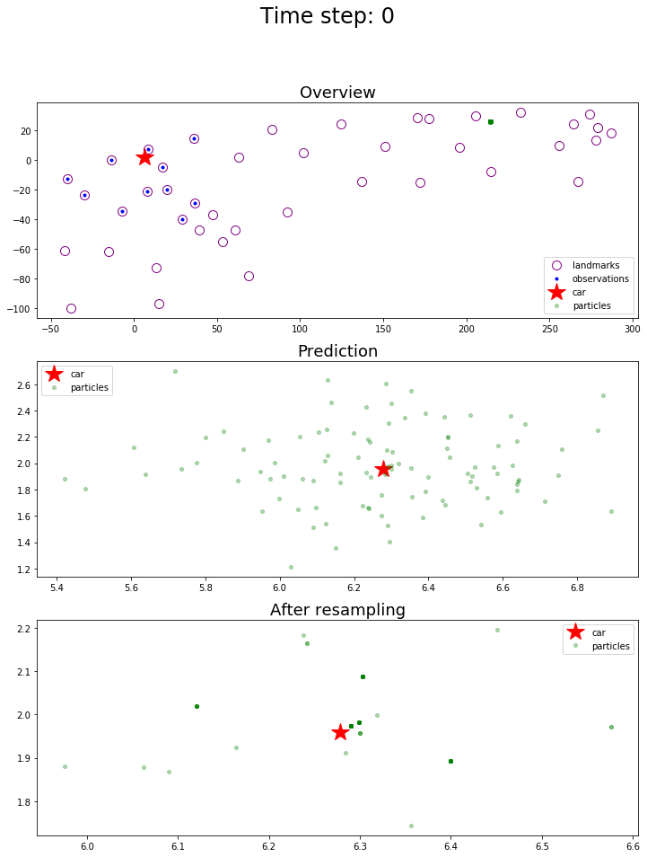
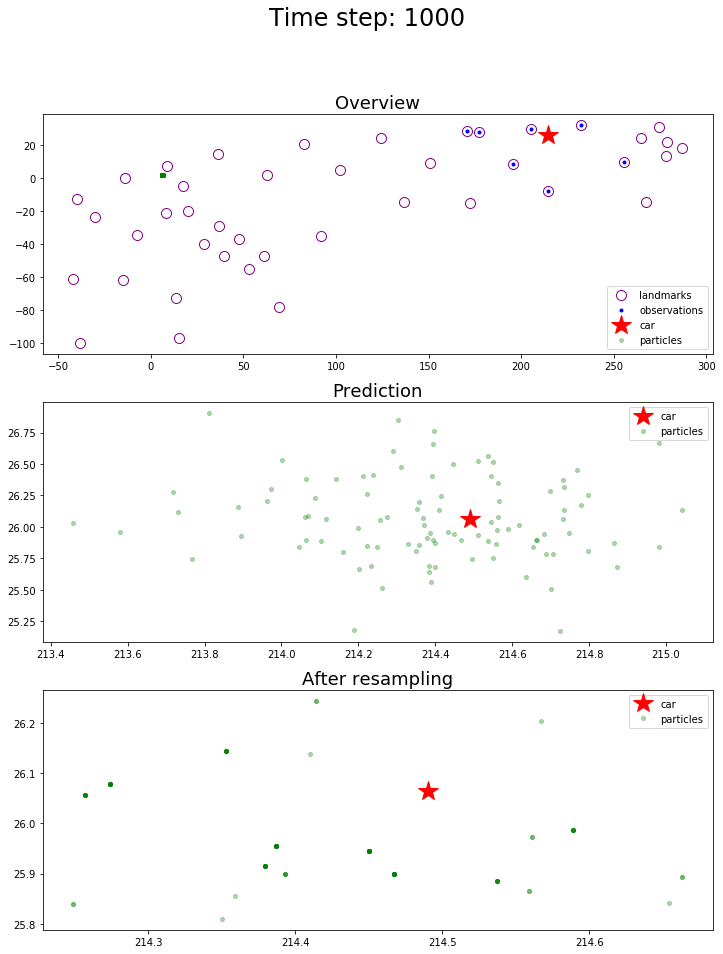

# Localization with Particle Filter

Jun Zhu

## Introduction
In this project, a 2 dimensional particle filter in C++ was implemented. The particle filter will be given a map and some initial localization information (analogous to what a GPS would provide). At each time step the filter will also get observation and control data.

